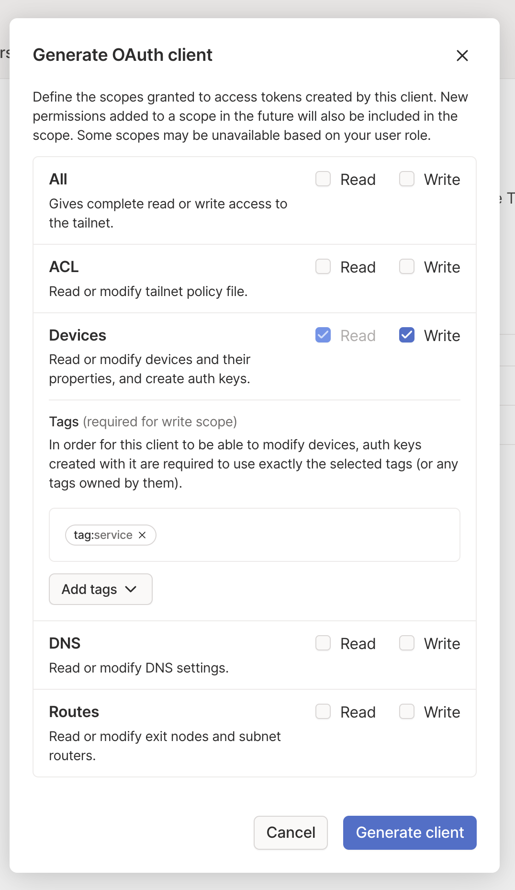
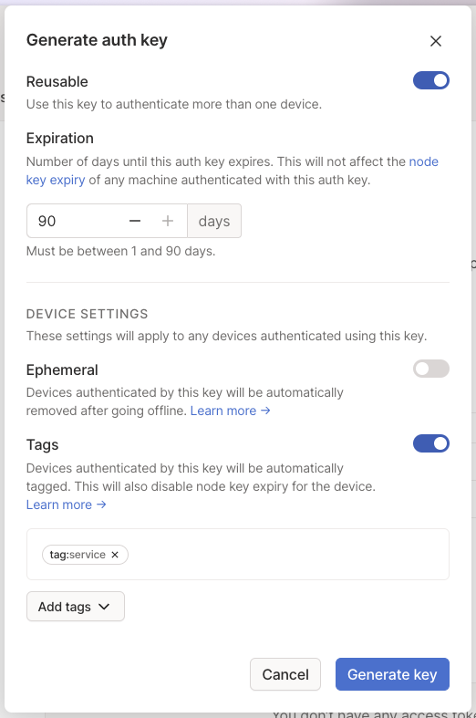
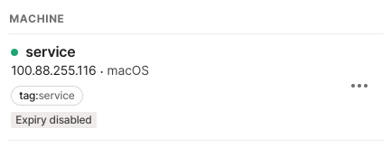

# Confusing Tailscale Behavior

I'm in the process of transitioning all of my home web serices over to a tailnet so I can ditch a homegrown system that involves tunneling https traffic over ssh. This is a bit of puzzling behavior I ran into with tailscale. However, it's not clear to me if this is a bug or just my own misunderstanding of the proper use of Auth Keys.

## Generating keys from an OAuth2 Client

This is the approach I started wtih. I created an OAuth2 client with the following settings.



The code for this approach is located in [with_oauth/main.go](with_oauth/main.go). With this code, two consectuive runs create two distinct machines in the admin console. You can also this reflected in the `DNSName`.

```
$ export TS_CLIENT_ID='...'
$ export TS_CLIENT_SECRECT='...'

$ go run with_oauth/main.go
service
$ go run with_oauth/main.go
service-1
```

## Using a tagged auth key

I originally thought the only way to create a machine with expiry disabled was the oauth2 client approach (above). In the process of trying to figure out why I was getting duplicate machines using oauth2, I created a tagged auth key with the following settings.



The code for this approach is located in [with_authkey/main.go](with_authkey/main.go). With this code, two consectuive runs DO NOT create two distinct machines in the console.

```
$ export TS_AUTHKEY='...'

$ go run with_authkey/main.go
service
$ go run with_authkey/main.go
service
```

Additionally, if I look at the `service` machine in the admin console, it shows as **expiry disabled** even though the auth key has a 90 day expiry.


